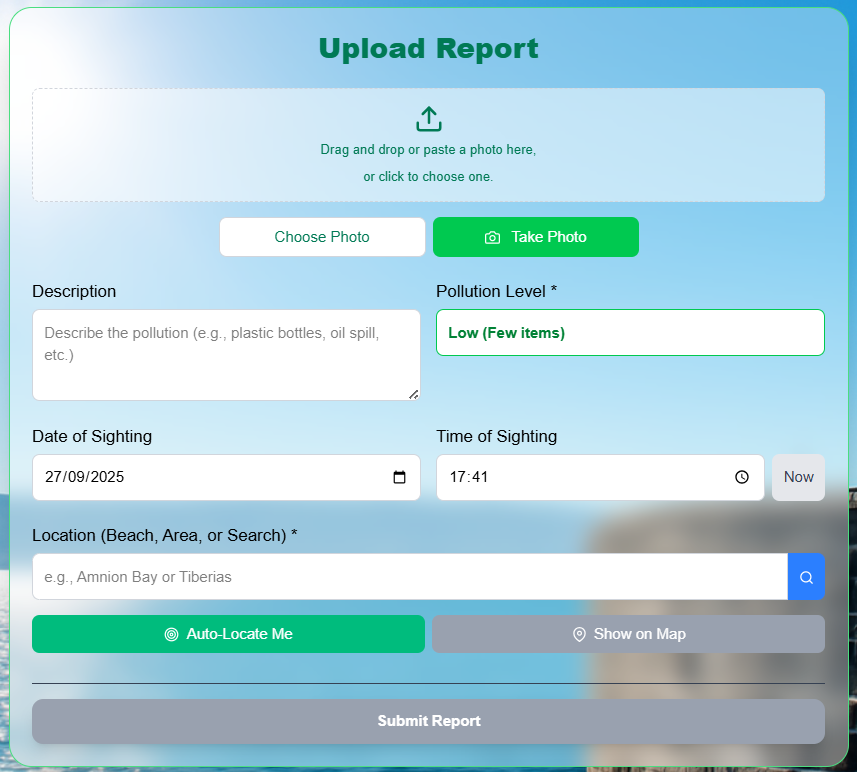
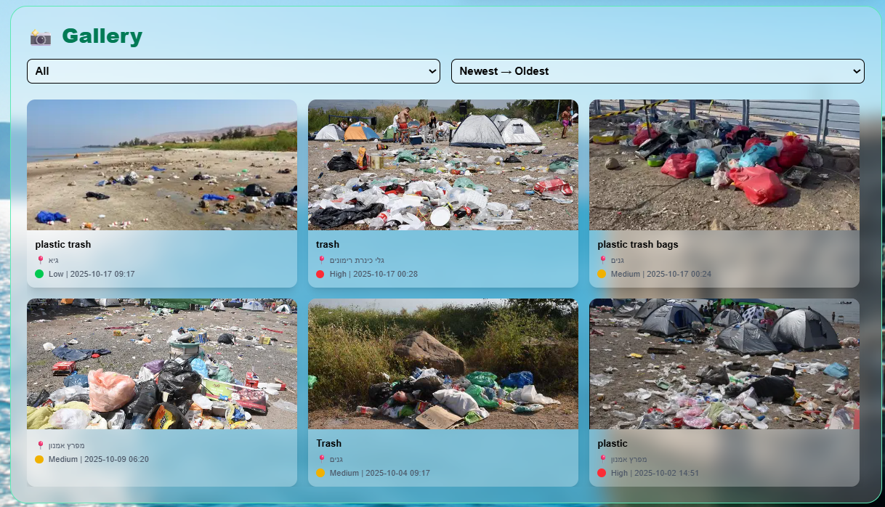
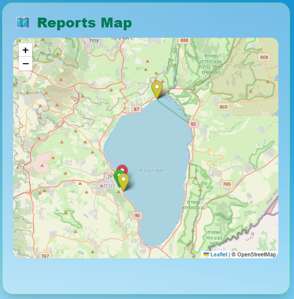

# 📸 EcoSnap – Sea of Galilee Pollution Reporter

## 🌿 About the Project

**EcoSnap** is a community-driven platform dedicated to monitoring and protecting the **Sea of Galilee (Kinneret)**.  
Our mission is to empower citizens to become active guardians of this vital natural resource by providing a simple and effective way to report pollution incidents.  
By leveraging technology, we aim to create a shared database of pollution reports that can be used by local authorities and environmental organizations to take informed and timely action.

---

## 🚀 Features

- **Simple Reporting:** Upload a photo, add a description, and specify the pollution level easily.  
- 📸 **Automatic Pollution Detection** using a YOLO model  
- 🧠 **Auto-Generated Description** from uploaded images  
- 📅 **Timestamped Reports** with image, description, and location  
- 🌍 **Community Engagement:** Encourage citizens to actively participate in protecting the environment  
- 🖼 **Interactive Gallery:** Browse all reported incidents, filter by pollution level, and sort by date  
- ⚙️ **Continuous Deployment:** The project is deployed on Vercel, ensuring seamless updates  
- 🔒 **Firebase Integration** for data storage and hosting  

---

## 🗺️ Visualization

EcoSnap displays all user reports on a **map with pins** representing each pollution report.  
Each pin shows a preview of the uploaded image, location, and date.  

✨ **Future Improvement:**  
We plan to add a **heatmap layer** to highlight pollution density across regions.

---

## 🧠 AI Integration

When users upload an image, EcoSnap’s YOLO model automatically detects pollution elements such as **bottles**, **plastic**, or **cans**, and generates a short **auto-description**.  
This helps in creating more consistent and informative environmental reports.

---

## 💻 Tech Stack

- **Frontend:** Next.js, React, Tailwind CSS  
- **Backend & Database:** Firebase Firestore  
- **AI Model:** TensorFlow.js (YOLO)  
- **Map Visualization:** React-Leaflet  
- **Hosting:** Vercel  

---

## 🖼 How It Works

The EcoSnap reporting process is designed to be simple and highly effective:

1. **Users upload a photo of pollution.**  
2. **The app automatically detects the location** or allows for manual input.  
3. **YOLO and CircularNet models detect objects** like plastic bottles, cans, paper, and other trash.  
4. **An initial report description is auto-filled by the AI detection.** Users can then review and manually **edit this description** before submission.  
5. **All reports are displayed in an interactive gallery** for the community and authorities, creating a powerful visualization of the problem.

---
## 🖼️ Demo / Screenshots

---

## 🙏 Contributing

We welcome contributions!  
If you have ideas for improvements, new features, or want to report a bug, please feel free to contact us or open an **issue** / **pull request** on this repository.

---

## ✉️ Contact Us

If you have any questions or feedback, feel free to reach out!  

- 👩‍💻 **Fatmeh Zoabi** – [fatmehzo3bi10@gmail.com](mailto:fatmehzo3bi10@gmail.com)  
- 👩‍💻 **Diana Hujerat** – [htdiana9@gmail.com](mailto:htdiana9@gmail.com)
